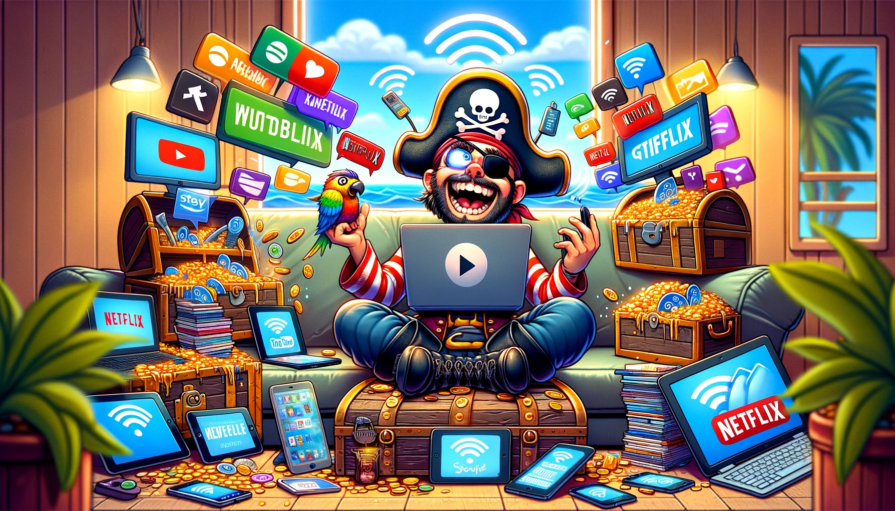

# StreamPirate 🏴‍☠️

Ahoy, digital navigators and cinephiles! Welcome aboard the **StreamPirate** ship, where we sail the vast seas of digital content, streaming our favorite shows and movies directly to our cove with ease and swagger. 🌊🎥

## Setup 🛠️

Before ye embark on this grand adventure, make sure ye deck is prepared:

1. **Install VLC Media Player**: Ye need the trusty VLC 📺 to view ye treasures. If it's not installed, find it at the [official VLC website](https://www.videolan.org/vlc/index.html) and install it.
2. **NPM & WebTorrent**: Fear not if ye aren't equipped with these tools; our script automatically checks and installs them for ye. 🧰

## How It Works 🗺️

1. **Finding Treasures**: Paste the magnet link or choose a .torrent file of the movie or show ye want to stream.
2. **Subtitles**: If ye speak the language of the seas but prefer reading in your mother tongue, ye can add subtitles by choosing a `.srt` file. 📜
3. **Streaming**: Hit the "Stream" button, and let our magic work. The content will start playing in VLC. 🍿✨

## Features 🌟

- **Simple to Use**: Even the most land-lubberly among ye can use it with ease.
- **Automatic Setup**: Ye don't need to worry about setting sails; our script prepares everything.
- **Subtitles Support**: For those who fancy a bit of reading with their viewing.

## Requirements 📋

- **Windows OS**: Designed for Windows 11, but hearty enough to run on older versions.
- **VLC Media Player**: Ye can't watch without it!
- **An Adventurous Spirit**: Ready to explore the digital oceans.

## Installation 🚀

1. **Download the release**: Get the latest release from the [Releases](https://github.com/bdr-pro/StreamPirate/releases) page.
2. **Extract the files**: Unzip the contents to a folder of your choice.
3. **Run the script**: Double-click on the `StreamPirate.exe` file in `dist` folder to start the script.

## Final Words from the Captain 🏴‍☠️

This is a tool for the brave, the curious, and the lovers of freedom on the digital seas. Remember, with great power comes great responsibility. Use it wisely and respect the creators of the content ye enjoy.

Happy Streaming, and may the winds be ever in your favor! 🌬️🖤

## Example 🎬

---

*Note: This guide is for educational and entertainment purposes only. Always respect copyright laws and consume content legally.*
